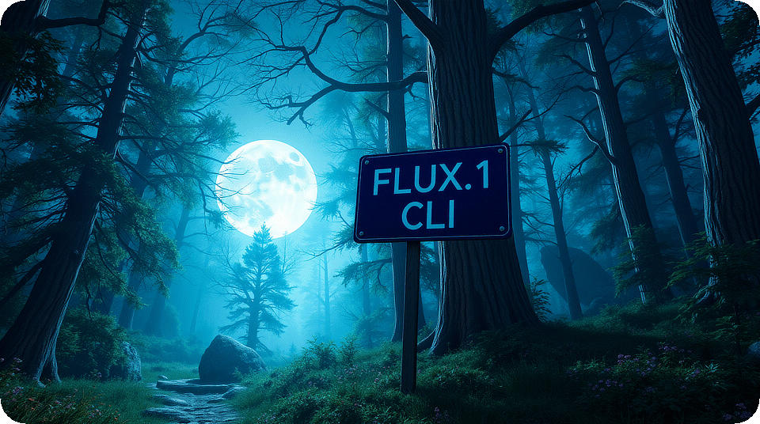

# FLUX.1 Inference CLI
> Supports MPS (Apple Silicon), CUDA and CPU



## Features

- **All Models**: Supports FLUX.1-schnell and FLUX.1-dev
- **Cross-Platform**: Supports MPS, CUDA and CPU
- **Tested on macOS**: Works perfectly on macOS[^1]

## Installation

**Cloning the repository**:
```bash
git clone https://github.com/SplittyDev/flux1-cli.git
cd flux1-cli
```

**Using uv (recommended)**:
```bash
uv venv
source .venv/bin/activate
uv pip sync requirements.txt
python3 main.py
```

**Using pip**:
```bash
python3 -m venv venv
source venv/bin/activate
python3 -m pip install -r requirements.txt
python3 main.py
```

## Prompting

The CLI supports various modifiers, which can be added to the end of the prompt:

| Modifier           | Description                                                |
| ------------------ | ---------------------------------------------------------- |
| `/f`, `/fast`      | Use a small number of inference steps for fast results     |
| `/s`, `/slow`      | Use a large number of inference steps for accurate results |
| `/a`, `/again`     | Reuse the previous seed for the next inference             |
| `/r`, `/random`    | Use a random seed for the next inference                   |
| `/<n>` if n < 128  | Use this number of inference steps for the next inference  |
| `/<n>` if n >= 128 | Set the resolution to `nxn`                                |
| `/<w>x<h>`         | Set the resolution to `wxh`                                |

**Good to know**:

- Simply pressing the <kbd>⏎</kbd> (return) key will repeat the last prompt
- Typing only modifiers applies the modifiers and reuses the last prompt
- Images are saved in the format `flux_<timestamp>_<seed>.png`

### Example workflows with modifiers

**Annotated example, explaning the thought process**

```ini
# Initial prompt. Generate images fast, to get a feeling for the prompt.
λ Prompt: Photograph of a meadow in a forest /fast
# Refine prompt. Fast mode is still active, no need to repeat it.
λ Prompt: High resolution photograph of a meadow in a forest
# This looks nice! Let's generate the same image again, but in slow mode.
λ Prompt: /again /slow
# Let's keep the same prompt, but randomize the seed again.
λ Prompt: /random
# Let's try it in landscape mode, but fast, to see if it looks better.
λ Prompt: /1920x1080 /fast
# Alright, let's call it a day
λ Prompt: /quit
```

**Real-world example, using shortcuts and no comments**

```ini
λ Prompt: Photograph of a moonlit meadow in a mythical forest/f
λ Prompt: 
λ Prompt: /a/s
λ Prompt: Stunning photograph of a moonlit meadow in a mythical forest, godrays/r/f
λ Prompt: /a/s
λ Prompt: /quit
```

## Troubleshooting

**High resolution images are broken**
> FLUX.1 has a maximum resolution of 2MP. These are _roughly_ the largest possible sizes[^2]:
> - 1:1 exact 1448 x 1448, rounded 1408 x 1408
> - 3:2 exact 1773 x 1182, rounded 1728 x 1152
> - 4:3 exact 1672 x 1254, rounded 1664 x 1216
> - 16:9 exact 1936 x 1089, rounded 1920 x 1088
> - 21:9 exact 2212 x 948, rounded 2176 x 960
>
> You can use an upscaler (not included) to increase the resolution.

<!-- Footnotes -->

[^1]: Tested on 2023 Mac Studio, 128GB Unified RAM, 24-Core Apple M2 Ultra
[^2]: See [this post on Reddit](https://www.reddit.com/r/StableDiffusion/comments/1enxdga/flux_recommended_resolutions_from_01_to_20/). Thanks `u/Aplakka`!
